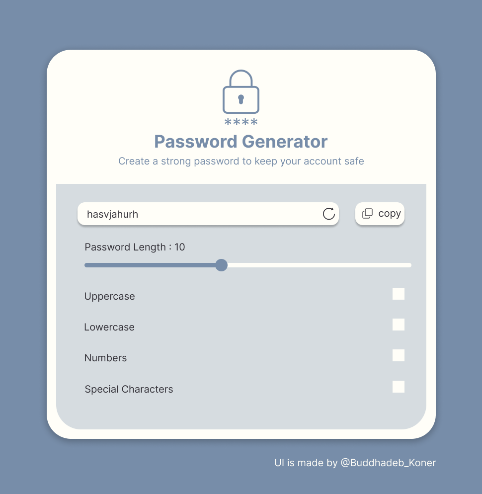

### Password Generator Using React Freamwork

#### Colne This Project And Contribute To This Project 

```bash
git clone
``` 
#### Install Tailwindcss
[Link Text](https://tailwindcss.com/docs/guides/vite)

#### Color Codes Are 
```bash
Primary-bg : #778DA9
Pass-gen-bg : #778DA9 with 30% opacity
Primary-light-color : #FFFEF8
Text-color : #333138
```

#### Final UI Output
